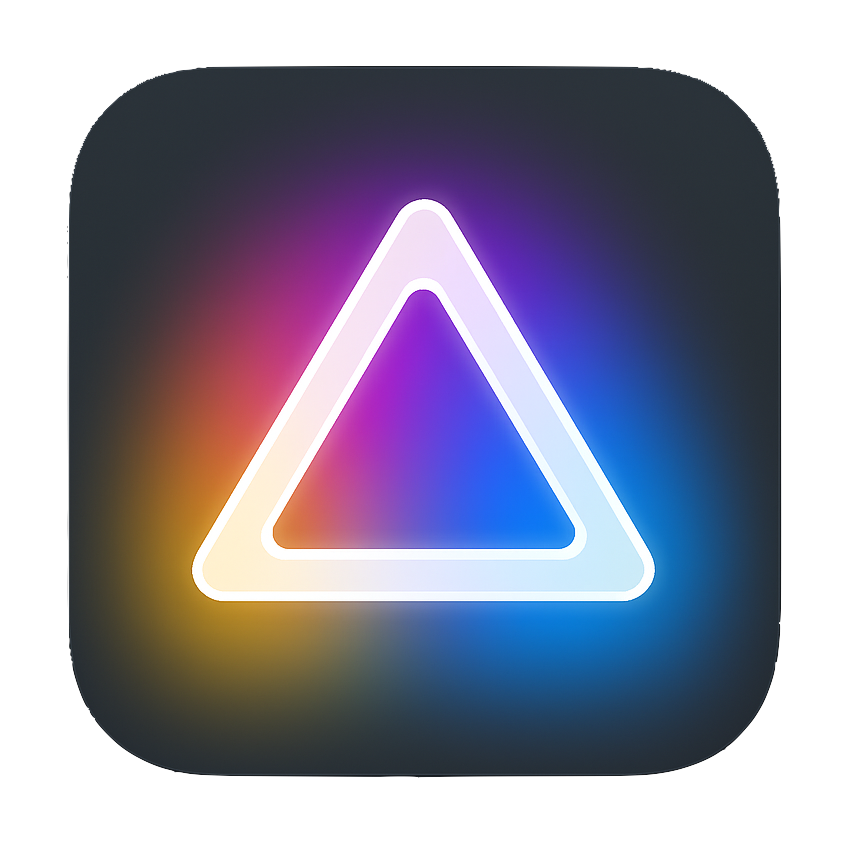
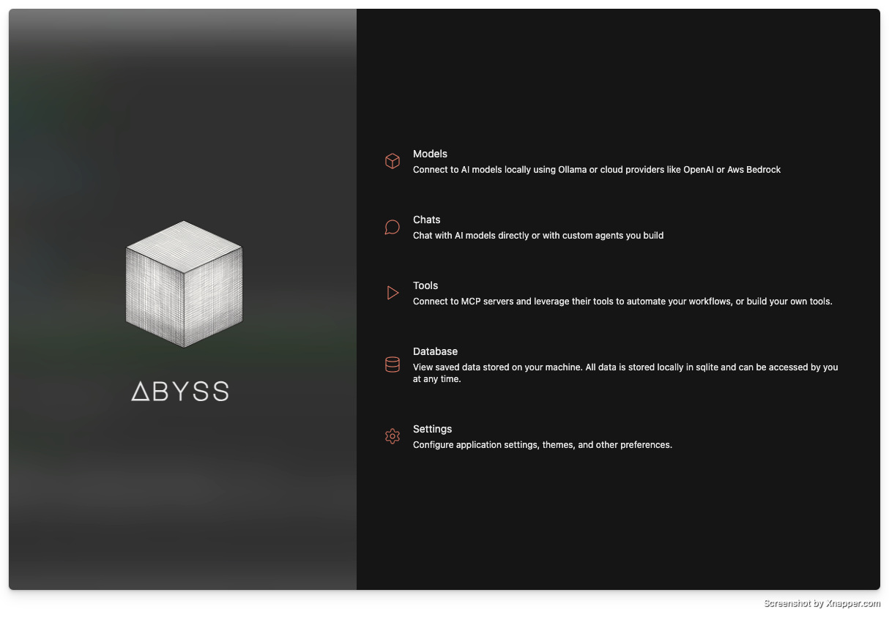
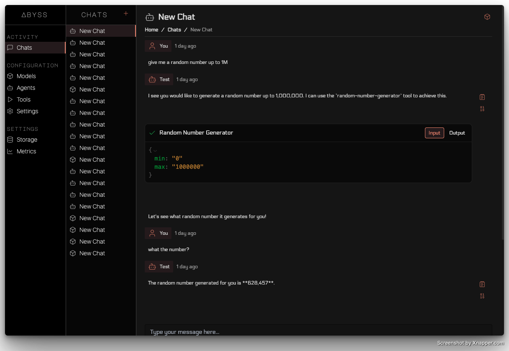

# Abyss

The Best AI Desktop Client


## Features

-   Fully open source, no login, no accounts, no tracking. Its yours.
-   Connect to, chat with, and build agents with LLMs



## [Download](https://github.com/anonymous-apps/abyss/releases)

See our releases page for the latest builds.

1. Download the latest ZIP
2. Unzip it and put in Applications **IT MUST BE IN APPLICATIONS OR IT WILL NOT WORK**
3. Run the app!

Support for MacOS only currently.

### Development

If you want to run the app locally, you can do so by running the following commands:

```bash
git clone https://github.com/anonymous-apps/Abyss
cd Abyss
npm i

# Boot the app!
npm run dev
```

### Building

Build your own version of the app.

```bash
npm run build
```

You will find the build in the `/packages/app/dist/mac` folder.
